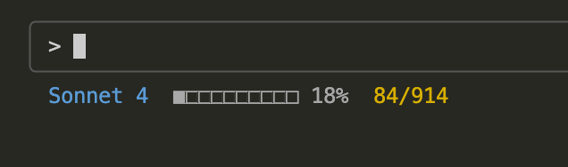
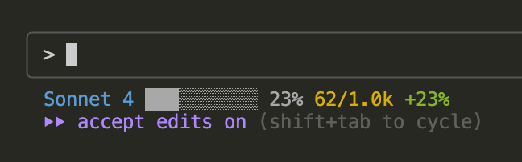

# Claude Code StatusLine

一个为 Claude Code CLI 定制的状态栏显示工具，实时显示模型信息、token 使用情况和费用统计。



## 新功能展示 - v2 增强版



v2 版本新增功能：
- 📊 **智能费用显示**: 自动进位显示（k/m后缀）
- 📈 **趋势指标**: 显示相对历史平均的百分比变化（绿色+表示高于平均，红色-表示低于平均）
- 🎨 **优化进度条**: 使用更直观的 █/▒ 字符

## 功能特性

- 🤖 **模型信息显示**: 显示当前使用的 Claude 模型
- 📊 **Token 使用监控**: 显示当前会话的 context token 使用情况(基于 160k 限制, cc会在80%即160k context的时候开始compact)
- 💰 **费用统计**: 基于ccusage显示当日/当月的 API 使用费用，支持智能进位显示和趋势分析
- 🎨 **彩色输出**: 使用不同颜色区分各类信息
- 📈 **进度条显示**: 直观显示 token 使用百分比

## 前置条件

安装 ccusage 工具用于费用统计：

```bash
npm install -g ccusage
```

## 安装配置

### 1. 复制脚本文件

将本项目中的脚本文件复制到 `~/.claude/` 目录下：

```bash
cp status-line.sh ~/.claude/
cp get-session-tokens.sh ~/.claude/
cp get-cost.sh ~/.claude/
chmod +x ~/.claude/*.sh
```

### 2. 配置 Claude Code

在你的 Claude Code 配置文件中添加 statusLine 配置：

```json
{
  "$schema": "https://json.schemastore.org/claude-code-settings.json",
  "model": "xxx",
  "statusLine": {
    "type": "command",
    "command": "~/.claude/status-line.sh"
  }
}
```

## 使用方法

配置完成后，启动 Claude Code CLI 即可在状态栏看到实时信息：

```bash
claude
```

状态栏格式为：
```
<模型名称>  <token使用进度条> <使用百分比>%  <当日费用>/<当月费用> [+/-X%]
```

示例输出：
```
# 基础版本 (v1)

Sonnet 4  ■■■□□□□□□□ 32%  5/128


# 增强版本 (v2) - 带趋势指标
Sonnet 4  ███▒▒▒▒▒▒▒ 19%  62/1.0k +23%
```

## 脚本说明

### status-line.sh
主状态栏脚本，负责整合各项信息并格式化输出。

### get-session-tokens.sh
分析当前会话的 transcript 文件，计算 context token 使用量：
- 支持 JSONL 格式的 transcript 文件
- 基于 160k token 限制计算使用百分比
- 显示进度条和百分比

### get-cost.sh
获取 API 使用费用统计：
- 依赖 `ccusage` 工具
- 显示当日费用/当月总费用，支持智能进位（k/m后缀）
- 智能趋势分析：显示相对历史平均的百分比差异
- 颜色编码：绿色表示高于平均，红色表示低于平均
- 如果工具不可用则显示 "N/A"

## 调试

如需调试 token 计算，可设置环境变量：

```bash
DEBUG_TOKENS=1 ~/.claude/get-session-tokens.sh < input.json
```

## 自定义

你可以根据需要修改脚本中的：
- 颜色配置（status-line.sh）
- Token 限制阈值（get-session-tokens.sh）
- 进度条样式（get-session-tokens.sh）
- 费用格式化规则（get-cost.sh）
- 趋势分析灵敏度（get-cost.sh）

## 故障排除

1. **状态栏不显示**: 检查脚本文件是否有执行权限
2. **Token 显示 N/A**: 检查 transcript 文件路径是否正确
3. **费用显示 N/A**: 检查是否安装了 `ccusage` 工具

## 兼容性

- 支持 macOS 和 Linux
- 需要 `jq` 和 `bc` 命令
- Claude Code CLI v0.8+